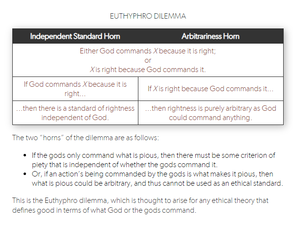

Everything about religion is open to interpretation, which is what leads to so many fights among people of the same religion. Catholics and Protestants share the majority of their beliefs and ethical principles, yet the groups have historically been at each other's throats over slight differences. And for what? What warrants all this bloodshed and death, in the name of a God who isn't supposed to believe in such things?

